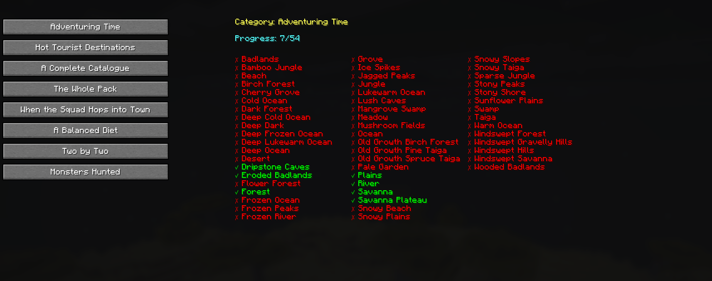

# Advancement Tracker

A Minecraft Fabric mod that adds detailed, real-time progress tracking for the game's grindiest "collect them all" advancements — so you can see exactly what you still have left to do.

## Tracked advancements

- **Adventuring Time** — discover all biomes
- **Hot Tourist Destinations** — discover all Nether biomes
- **A Complete Catalogue** — tame all cat variants
- **The Whole Pack** — tame all wolf variants
- **When the Squad Hops into Town** — use a lead on all frog variants
- **A Balanced Diet** — eat one of every food item
- **Two by Two** — breed every pair of animals
- **Monsters Hunted** — kill one of every hostile mob

## Features

- Per-requirement progress with live updates as you play — no more guessing which biome or mob you're missing.
- A dedicated screen to browse your progress, opened with a keybind (default: **J**, rebindable in Controls).
- Server–client synchronization, so tracking works in multiplayer.
- Lightweight, with minimal performance impact.



## Installation

1. Install [Fabric Loader](https://fabricmc.net/use/installer/)
2. Install [Fabric API](https://modrinth.com/mod/fabric-api)
3. Download the mod from [Modrinth](https://modrinth.com/mod/advancement-tracker) or the Releases page
4. Place the jar in your `mods` folder

## Building

```bash
./gradlew clean build
```

The built jar lands in `build/libs/`. To run a dev client, use `./gradlew runClient`.

## Compatibility

- Minecraft: 26.2
- Fabric Loader: 0.19.3+
- Fabric API: 0.158.0+26.2

## License

This mod is licensed under the MIT License. See [LICENSE](LICENSE) for details.
